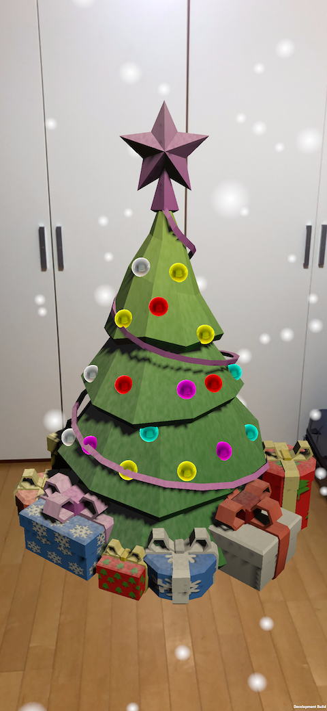
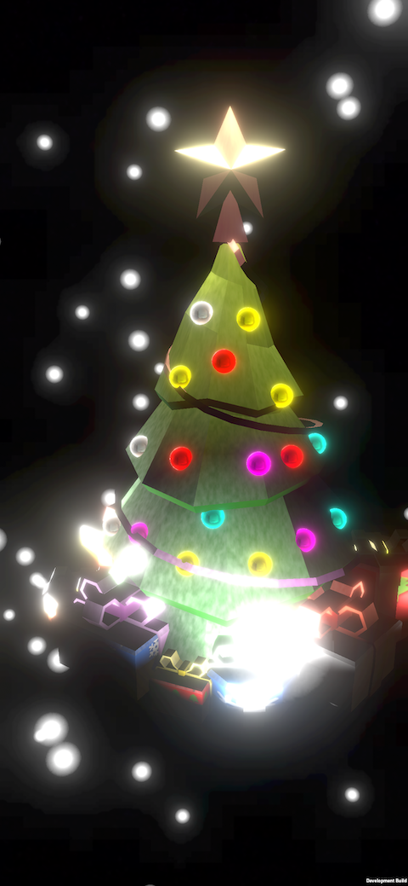

# AR Christmas

## Demo
### Youtube link
[youtube link](https://youtu.be/GhJBOPJLShk)

### Images

## Features
- decoration
- photos
- light estimation
- scale
- save / load

## Reference
- [Unity AR Foundation samples](https://github.com/Unity-Technologies/arfoundation-samples)
- [Dilmer Valecillos (Youtuber who works on AR tutorials)](https://www.youtube.com/playlist?list=PLQMQNmwN3FvzLN-8moCKmZb00gr7sdcrZ)

## Things I'm still working on
- multi-player
- people occlusion (保留)
- scene transition 
- tree 移動 (next)

## Thanks

Icons made by <a href="https://www.flaticon.com/authors/smashicons" title="Smashicons">Smashicons</a> from <a href="https://www.flaticon.com/" title="Flaticon">www.flaticon.com</a></div
